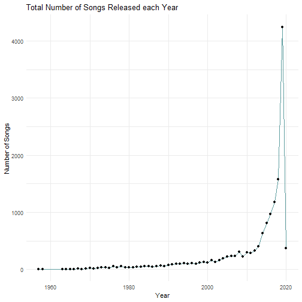
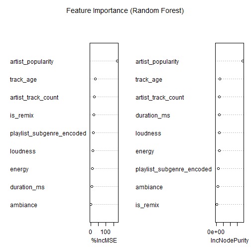

``` r
options(repos = c(CRAN = "https://cloud.r-project.org/"))
```

Title: Spotify Popularity Analysis and Music Segmentation
Authors: Bilal Nadeem Amin (24068960)
         Wen Qing (24067679)
         Zhang XinYu (24085923)
         Sun Xiaobo (24068064)
         Zhihang Li (24081305）
         

Introduction

Music is just another form of data generated by people for entertainment. It carries signal and meaningful information, holding the potential to uncover patterns that can help improve music creation and consumption altogether.
In the industry, artists and music producers value insights into what makes their songs popular. On the other hand, consumers who use music streaming apps want convenience in navigating and exploring different music based on their
taste. This project aims to dive deep into a dataset of 30,000 Spotify tracks and accomplish two key tasks:
   1) Segment the tracks into mood based clusters to drive playlist generation
   2) Predict the popularity of a song based on the songs' audio, temporal and genre information
   


``` r
# Install the required R packages
install.packages('naniar')
```

```
## Installing package into 'C:/Users/ASUS/AppData/Local/R/win-library/4.4'
## (as 'lib' is unspecified)
```

```
## package 'naniar' successfully unpacked and MD5 sums checked
## 
## The downloaded binary packages are in
## 	C:\Users\ASUS\AppData\Local\Temp\RtmpQTJhs3\downloaded_packages
```

``` r
install.packages('lubridate')
```

```
## Installing package into 'C:/Users/ASUS/AppData/Local/R/win-library/4.4'
## (as 'lib' is unspecified)
```

```
## package 'lubridate' successfully unpacked and MD5 sums checked
## 
## The downloaded binary packages are in
## 	C:\Users\ASUS\AppData\Local\Temp\RtmpQTJhs3\downloaded_packages
```

``` r
install.packages('ggplot2')
```

```
## Installing package into 'C:/Users/ASUS/AppData/Local/R/win-library/4.4'
## (as 'lib' is unspecified)
```

```
## package 'ggplot2' successfully unpacked and MD5 sums checked
## 
## The downloaded binary packages are in
## 	C:\Users\ASUS\AppData\Local\Temp\RtmpQTJhs3\downloaded_packages
```

``` r
install.packages('dplyr')
```

```
## Installing package into 'C:/Users/ASUS/AppData/Local/R/win-library/4.4'
## (as 'lib' is unspecified)
```

```
## package 'dplyr' successfully unpacked and MD5 sums checked
## 
## The downloaded binary packages are in
## 	C:\Users\ASUS\AppData\Local\Temp\RtmpQTJhs3\downloaded_packages
```

``` r
install.packages("tidyr")
```

```
## Installing package into 'C:/Users/ASUS/AppData/Local/R/win-library/4.4'
## (as 'lib' is unspecified)
```

```
## package 'tidyr' successfully unpacked and MD5 sums checked
## 
## The downloaded binary packages are in
## 	C:\Users\ASUS\AppData\Local\Temp\RtmpQTJhs3\downloaded_packages
```

``` r
install.packages("ggcorrplot")
```

```
## Installing package into 'C:/Users/ASUS/AppData/Local/R/win-library/4.4'
## (as 'lib' is unspecified)
```

```
## package 'ggcorrplot' successfully unpacked and MD5 sums checked
## 
## The downloaded binary packages are in
## 	C:\Users\ASUS\AppData\Local\Temp\RtmpQTJhs3\downloaded_packages
```

``` r
install.packages('cluster')
```

```
## Installing package into 'C:/Users/ASUS/AppData/Local/R/win-library/4.4'
## (as 'lib' is unspecified)
```

```
## package 'cluster' successfully unpacked and MD5 sums checked
## 
## The downloaded binary packages are in
## 	C:\Users\ASUS\AppData\Local\Temp\RtmpQTJhs3\downloaded_packages
```

``` r
install.packages("scales")
```

```
## Installing package into 'C:/Users/ASUS/AppData/Local/R/win-library/4.4'
## (as 'lib' is unspecified)
```

```
## package 'scales' successfully unpacked and MD5 sums checked
## 
## The downloaded binary packages are in
## 	C:\Users\ASUS\AppData\Local\Temp\RtmpQTJhs3\downloaded_packages
```

``` r
install.packages("ClusterR")
```

```
## Installing package into 'C:/Users/ASUS/AppData/Local/R/win-library/4.4'
## (as 'lib' is unspecified)
```

```
## package 'ClusterR' successfully unpacked and MD5 sums checked
## 
## The downloaded binary packages are in
## 	C:\Users\ASUS\AppData\Local\Temp\RtmpQTJhs3\downloaded_packages
```

``` r
install.packages("randomForest")
```

```
## Installing package into 'C:/Users/ASUS/AppData/Local/R/win-library/4.4'
## (as 'lib' is unspecified)
```

```
## package 'randomForest' successfully unpacked and MD5 sums checked
## 
## The downloaded binary packages are in
## 	C:\Users\ASUS\AppData\Local\Temp\RtmpQTJhs3\downloaded_packages
```

``` r
install.packages("caret")
```

```
## Installing package into 'C:/Users/ASUS/AppData/Local/R/win-library/4.4'
## (as 'lib' is unspecified)
```

```
## package 'caret' successfully unpacked and MD5 sums checked
## 
## The downloaded binary packages are in
## 	C:\Users\ASUS\AppData\Local\Temp\RtmpQTJhs3\downloaded_packages
```

``` r
install.packages("Metrics")
```

```
## Installing package into 'C:/Users/ASUS/AppData/Local/R/win-library/4.4'
## (as 'lib' is unspecified)
```

```
## package 'Metrics' successfully unpacked and MD5 sums checked
## 
## The downloaded binary packages are in
## 	C:\Users\ASUS\AppData\Local\Temp\RtmpQTJhs3\downloaded_packages
```

``` r
# Load the R packages
library(tidyr)            
library(naniar)
library(lubridate)
```

```
## 
## Attaching package: 'lubridate'
```

```
## The following objects are masked from 'package:base':
## 
##     date, intersect, setdiff, union
```

``` r
library(ggplot2)
library(dplyr)
```

```
## 
## Attaching package: 'dplyr'
```

```
## The following objects are masked from 'package:stats':
## 
##     filter, lag
```

```
## The following objects are masked from 'package:base':
## 
##     intersect, setdiff, setequal, union
```

``` r
library(ggcorrplot)
library(cluster)
library(scales)
library(ClusterR)
library(randomForest)
```

```
## randomForest 4.7-1.2
```

```
## Type rfNews() to see new features/changes/bug fixes.
```

```
## 
## Attaching package: 'randomForest'
```

```
## The following object is masked from 'package:dplyr':
## 
##     combine
```

```
## The following object is masked from 'package:ggplot2':
## 
##     margin
```

``` r
library(caret)
```

```
## Loading required package: lattice
```

``` r
library(Metrics)
```

```
## 
## Attaching package: 'Metrics'
```

```
## The following objects are masked from 'package:caret':
## 
##     precision, recall
```

First the dataset is converted into a dataframe.


``` r
# Read the source data into a dataframe
songsdf <- read.csv('30000 spotify songs.csv')

cat("\nNumber of records in dataset: ", nrow(songsdf), "\n\n")
```

```
## 
## Number of records in dataset:  32833
```

``` r
cat("Number of columns in dataset: ", ncol(songsdf), "\n\n")
```

```
## Number of columns in dataset:  23
```

The number of records and columns in the dataframe are 32833 and 23 respectively.

The missingness in the data is visualized using the naniar package.


``` r
# Visualize missingness in data
vis_miss(songsdf) + labs(title = "Missingness before cleaning")
```


There is very minimal missingness in the data, so all the missing data is dropped from the dataframe.


``` r
# Filter out records with missing data
songsdf_clean <- songsdf[complete.cases(songsdf), ]

cat("Number of records in dataset after removing missing data: ", nrow(songsdf_clean), "\n\n")
```

```
## Number of records in dataset after removing missing data:  32828
```

The number of records in the dataframe after removing the missing data is 32828.


``` r
# Visualize missingness in data after cleaning
vis_miss(songsdf_clean) + labs(title = "Missingness after cleaning")
```


Next we need to make sure that there are no duplicate songs in the dataframe. Realistically, it is possible for multiple songs to exist with the same name,
thus we identified the unique song-artist pair and filter accordingly.


``` r
# Identify number of tracks that have unique track-artist pairs
unique_tracks <- songsdf_clean %>%
  distinct(track_name, track_artist) %>%
  nrow()

cat("Number of unique tracks in dataset: ", unique_tracks, "\n\n")
```

```
## Number of unique tracks in dataset:  26229
```

There are 26229 unique songs in the dataframe.


``` r
# Keep only unique track-artist pairs
songsdf_clean <- songsdf_clean %>%
  distinct(track_name, track_artist, .keep_all = TRUE)
```

Since we will be working with song audio data, we need to ensure there are no outliers as clustering algorithms like KMeans can be very sensitive to them.
We created a function to calculate the upper and lower bounds of an audio column and filter the data that lies outside these extremes.


``` r
# Define a function to remove outliers from audio features
filter_outlier <- function(df, column_name) {
  
  # Calculate Q1, Q3, and IQR
  Q1 <- quantile(df[[column_name]], 0.25, na.rm = TRUE)
  Q3 <- quantile(df[[column_name]], 0.75, na.rm = TRUE)
  IQR <- Q3 - Q1
  
  # Define bounds
  lower_bound <- Q1 - 1.5 * IQR
  upper_bound <- Q3 + 1.5 * IQR
  
  # Filter the outliers
  df <- df %>%
    filter(.data[[column_name]] >= lower_bound & .data[[column_name]] <= upper_bound)
  
  return(df)
}
```

The outliers in all the audio columns are removed and the audio data is visualized using a boxplot before and after removal of outliers.


``` r
# Identify outliers in loudness
audio_loudness_df <- songsdf_clean %>%
  select(loudness)

ggplot(audio_loudness_df, aes(x = "", y = loudness)) +
  geom_boxplot(outlier.colour = "red") +
  theme(axis.text.x = element_text(angle = 45, hjust = 1)) +
  labs(title = "Boxplot of Loudness with outliers", x = "Loudness", y = "Value in dB")
```


``` r
# Filter the outliers in loudness
songsdf_clean <- filter_outlier(songsdf_clean, 'loudness')

audio_loudness_df <- songsdf_clean %>%
  select(loudness)

ggplot(audio_loudness_df, aes(x = "", y = loudness)) +
  geom_boxplot(outlier.colour = "red") +
  theme(axis.text.x = element_text(angle = 45, hjust = 1)) +
  labs(title = "Boxplot of Loudness without outliers", x = "Loudness", y = "Value in dB")
```


``` r
# Identify outliers in tempo
audio_tempo_df <- songsdf_clean %>%
  select(tempo)

ggplot(audio_tempo_df, aes(x = "", y = tempo)) +
  geom_boxplot(outlier.colour = "red") +
  theme(axis.text.x = element_text(angle = 45, hjust = 1)) +
  labs(title = "Boxplot of Tempo with outliers", x = "Tempo", y = "Value in bpm")
```


``` r
# Filter the outliers in tempo
songsdf_clean <- filter_outlier(songsdf_clean, 'tempo')

audio_tempo_df <- songsdf_clean %>%
  select(tempo)

ggplot(audio_tempo_df, aes(x = "", y = tempo)) +
  geom_boxplot(outlier.colour = "red") +
  theme(axis.text.x = element_text(angle = 45, hjust = 1)) +
  labs(title = "Boxplot of Tempo without outliers", x = "Tempo", y = "Value in bpm")
```


``` r
# Create a vector of audio features that range from 0.0 to 1.0
audio_0to1 <- c('danceability','energy','speechiness','acousticness',
                'instrumentalness','liveness','valence')

# Identify outliers in audio features that range from 0.0 to 1.0
audio_0to1_df <- songsdf_clean[, audio_0to1]

audio_0to1_df_long <- audio_0to1_df %>%
  pivot_longer(cols = everything(), names_to = "feature", values_to = "value")

ggplot(audio_0to1_df_long, aes(x = feature, y = value)) +
  geom_boxplot(outlier.colour = "red") +
  theme(axis.text.x = element_text(angle = 45, hjust = 1)) +
  labs(title = "Boxplots of audio data ranging from 0.0 to 1.0 with outliers", x = "Audio Feature",
       y = "Value")
```


``` r
# Filter the outliers in each audio ranging from 0.0 to 1.0 one by one
for (col in audio_0to1) {
  songsdf_clean <- filter_outlier(songsdf_clean, col)
}

# Visualize the boxplots of the audio data after removing outliers
audio_0to1_df <- songsdf_clean[, audio_0to1]

audio_0to1_df_long <- audio_0to1_df %>%
  pivot_longer(cols = everything(), names_to = "feature", values_to = "value")

ggplot(audio_0to1_df_long, aes(x = feature, y = value)) +
  geom_boxplot(outlier.colour = "red") +
  theme(axis.text.x = element_text(angle = 45, hjust = 1)) +
  labs(title = "Boxplots of audio data ranging from 0.0 to 1.0 without outliers", x = "Audio Feature",
       y = "Value")
```


``` r
# Identify outliers in duration_ms
audio_duration_df <- songsdf_clean %>%
  select(duration_ms)

ggplot(audio_duration_df, aes(x = "", y = duration_ms)) +
  geom_boxplot(outlier.colour = "red") +
  theme(axis.text.x = element_text(angle = 45, hjust = 1)) +
  labs(title = "Boxplot of duration with outliers", x = "duration_ms", y = "Value")
```


``` r
# Filter the outliers in duration_ms
songsdf_clean <- filter_outlier(songsdf_clean, 'duration_ms')

audio_duration_df <- songsdf_clean %>%
  select(duration_ms)

ggplot(audio_duration_df, aes(x = "", y = duration_ms)) +
  geom_boxplot(outlier.colour = "red") +
  theme(axis.text.x = element_text(angle = 45, hjust = 1)) +
  labs(title = "Boxplot of duration without outliers", x = "duration_ms", y = "Value")
```


``` r
cat("Number of records in dataset after removing outliers: ", nrow(songsdf_clean), "\n")
```

```
## Number of records in dataset after removing outliers:  14924
```

After filtering the outliers, the number of records in the dataframe is now 14924.

Now that the data is clean, we begin clustering the songs.


``` rclustering

```

When it comes to clustering, it is important to retain features that are informative and show little to no redundancy with other features.
Therefore, we first identified which features are important based on how they interact with each other. We plotted a correlation matrix to visualize this.


``` r
# List all the audio features for a correlation matrix
corr_feature_vec <- c('danceability','energy','loudness','speechiness','acousticness',
              'instrumentalness','liveness','valence','tempo')

corr_features <- songsdf_clean[,corr_feature_vec]

# Calculate the correlation matrix of the audio features
cor_matrix <- cor(corr_features, use = "complete.obs")

# Plot the correlation matrix of the audio features
ggcorrplot(cor_matrix,
           method = "square",
           type = "full",   
           lab = TRUE,
           lab_size = 3,
           title = "Correlation Matrix Of Audio Features",
           colors = c("blue", "white", "red"))
```


Loudness has a decent amount of positive correlation with energy, and tempo and speechiness show barely any correlation with the other features. Hence, these features
are dropped from the feature set.


``` r
features <- c('danceability','energy','acousticness',
              'instrumentalness','liveness','valence')

df <- songsdf_clean
```

A dataframe representing only the selected audio features is created.


``` r
# Create a dataframe with audio features only
X_df <- df %>%
  select(all_of(features))
```

To account for difference in scales between features, z-score normalization is applied to the feature dataframe so that each feature is comparable when modeling.


``` r
# Scale the data with z-score normalization
X_scaled <- scale(X_df)

# Set seed for reproducibility
set.seed(123)
```

KMeans clustering algorithm is chosen for this problem as it scales efficiently with a large dataset like ours, it works well with purely numerical features like audio data, 
and since each cluster has a centroid, interpretation is easy. KMeans requires the identification of k or the number of clusters to form. For the first iteration, a value of k=3 is selected.


``` r
# Perform K-means clustering
kmeans_model <- kmeans(X_scaled, centers = 3, nstart = 20)
```

Since KMeans groups data points based on similarity, we calculated Euclidean distance as its similarity metric.


``` r
# Calculate the Euclidean distance matrix of the features
euc_dist <- dist(X_scaled)
```

To evaluate the structure of our resulting clusters, we used Silhouette score as the evaluation metric.


``` r
# Calculate the silhouette score
sil_score <- silhouette(kmeans_model$cluster, euc_dist)

# Display the average silhouette width 
cat("Initial kmeans clustering silhouette score with k = 3: ", 
    mean(sil_score[, 3]), "\n\n")
```

```
## Initial kmeans clustering silhouette score with k = 3:  0.1884976
```


As expected, the initial 3 clusters produced by KMeans have poor structure, indicated by a silhouette score of 0.1884976. To improve the results of clustering,
we will engineer more meaningful features and determine the optimal number of clusters to form.
We will create features like intensity that combines loudness and tempo to which tends to be high in hardcore music, ambiance that combines acousticness and instrumentalness for finding classical-like music,
a product of valence and energy that would represent the emotional quadrant of music and some other ones.
  


``` r
# Feature engineering to improve clustering
df$vocals <- (1 - df$instrumentalness)
df$intensity <- (df$loudness * df$tempo)
df$ambiance <- (df$acousticness * df$instrumentalness)
df$val_energy <- (df$valence * df$energy)
df$vibeness <- (df$danceability * df$energy)
```

We will plot the correlation matrix again to visualize how the new features correlate with the existing ones and the new ones.


``` r
# List all the audio features including engineered ones for a correlation matrix
corr_feature_vec <- c('danceability','energy','loudness','speechiness','acousticness',
                      'instrumentalness','liveness','valence','tempo','vocals',
                      'intensity','ambiance','val_energy','vibeness')

corr_features <- df[,corr_feature_vec]

# Calculate the correlation matrix of the new audio features
cor_matrix <- cor(corr_features, use = "complete.obs")

# Plot the correlation matrix of the new audio features
ggcorrplot(cor_matrix,
           method = "square",
           type = "full",   
           lab = TRUE,
           lab_size = 3,
           title = "Correlation Matrix Of New Audio Features",
           colors = c("blue", "white", "red"))
```


The product of valence and energy, intensity and ambiance stood out as the only features with a moderate to low correlation with each other, hence they were selected as the new features.


``` r
new_features <- c('val_energy', 'intensity', 'ambiance')

# Create a new dataframe with new audio features
X_df <- df %>%
  select(all_of(new_features))

# Scale the data with z-score normalization
X_scaled <- scale(X_df)
```

Before commencing the next iteration of clustering, an Elbow Method plot is visualized to determine the optimal number of clusters to form. The Elbow Method plot
graphically represents the total within cluster sum of squares against the number of clusters. As WCSS decreases, the clusters get tighter, but if the model improvement rate
decreases after a certain number of clusters, that number is the elbow point.
We will use a scree plot to visualize the elbow.
 


``` r
# Visualize Elbow method to determine optimal number of clusters
wss <- numeric(10)
set.seed(123)

n <- 10

for (k in 1:n) {
  cluster_model <- kmeans(X_scaled, centers = k, nstart = 20)
  wss[k] <- cluster_model$tot.withinss
}
```

```
## Warning: Quick-TRANSfer stage steps exceeded maximum (= 746200)
## Warning: Quick-TRANSfer stage steps exceeded maximum (= 746200)
## Warning: Quick-TRANSfer stage steps exceeded maximum (= 746200)
## Warning: Quick-TRANSfer stage steps exceeded maximum (= 746200)
## Warning: Quick-TRANSfer stage steps exceeded maximum (= 746200)
```

``` r
wss_df <- tibble(clusters = 1:n, wss = wss)

scree_plot <- ggplot(wss_df, aes(x = clusters, y = wss, group = 1)) +
  geom_point(size = 4)+
  geom_line() +
  scale_x_continuous(breaks = c(2, 4, 6, 8, 10)) +
  xlab('Number of clusters') +
  labs(
    title = "Elbow Method for optimal K",
    y = "Total Within-Cluster Sum of Squares"
  )

scree_plot +
  geom_hline(
    yintercept = wss, 
    linetype = 'dashed', 
    col = c(rep('#000000',10))
  )
```


According to the Elbow Method plot, the total within cluster sum of squares decreases slower after adding more than 4 clusters. Hence, k = 4 for our next iteration.


``` r
# Set seed for reproducibility
set.seed(123)

# Perform K-means clustering
kmeans_model <- kmeans(X_scaled, centers = 4, nstart = 25)
```

```
## Warning: Quick-TRANSfer stage steps exceeded maximum (= 746200)
```

``` r
# Calculate the Euclidean distance matrix of the features
euc_dist <- dist(X_scaled)

# Calculate the silhouette score
sil_score <- silhouette(kmeans_model$cluster, euc_dist)

# Display the average silhouette width 
cat("Kmeans silhouette score with k = 4: ", mean(sil_score[, 3]), "\n\n")
```

```
## Kmeans silhouette score with k = 4:  0.3585955
```

The new silhouette score from KMeans clustering is 0.3585955, which is a significant improvement in cluster structure than before.
Now we will visualize the cluster shape using Principal Component Analysis (PCA). In datasets like these where there is high dimensionality,
PCA is a technique used to reduce the number of dimensions. This helps in analysis too as it enables the projection of multiple features on a
two-dimensional plane.


``` r
# Perform PCA on scaled data
pca_result <- prcomp(X_scaled, center = TRUE, scale. = TRUE)

# Extract first two principal components
pca_df <- as.data.frame(pca_result$x[, 1:2])

# Add cluster labels from KMeans
pca_df$cluster <- as.factor(kmeans_model$cluster)

# Plot PCA
ggplot(pca_df, aes(x = PC1, y = PC2, color = cluster)) +
  geom_point(size = 2.5, alpha = 0.7) +
  labs(
    title = "PCA Visualization of KMeans Clusters",
    x = "Principal Component 1",
    y = "Principal Component 2"
  ) +
  scale_color_brewer(palette = "Set1") +
  theme_minimal()
```


The clusters show a decent amount of separation and compactness, although there is noticeable overlap between clusters 1,2 and 3.

To interpret these clusters, we will calculate the mean of each feature and compare it across clusters to identify the kind of moods they represent.


``` r
# Store kmeans clusters in the feature dataframe
X_df$cluster <- as.factor(kmeans_model$cluster)

# Calculate the mean value of each cluster
cluster_profile <- X_df %>%
  group_by(cluster) %>%
  summarise(
    mean_val_energy = round(mean(val_energy), 3),
    mean_intensity = round(mean(intensity), 3),
    mean_ambiance = round(mean(ambiance), 3)
  )

# Display the cluster profiles
cluster_profile
```

```
## # A tibble: 4 × 4
##   cluster mean_val_energy mean_intensity mean_ambiance
##   <fct>             <dbl>          <dbl>         <dbl>
## 1 1                 0.358          -904.         0.005
## 2 2                 0.582          -583.         0    
## 3 3                 0.309         -1196.         0    
## 4 4                 0.257          -625.         0
```

Cluster 1 has a distinctive mean ambiance from the rest of the clusters, indicating slightly lower electronic element. Combined with a high intensity and low emotional
moderate emotional tone, this cluster may represent energetic EDM-like songs that people would dance to. Cluster 2 has the highest val_energy component, suggesting that
this segment has the happiest songs. It also has the least intensity so this cluster may represent upbeat songs that people would chill to. Cluster 3 has a moderate val_energy
but the highest intensity out of all clusters, indicative of a sadder, angry, rock-like music segment. Cluster 4 has the lowest val_energy product, hinting at a relaxed yet
electronic vibe, kind of like lo-fi music.

Now that we have interpreted the clusters, we will assign a mood to each song in the original dataframe.
   


``` r
# Save the clusters from the feature dataframe to the main dataframe
df$cluster <- X_df$cluster

# Assign a mood to each cluster based on the cluster profiles
df$mood <- case_when(
  df$cluster == 1 ~ "Party",
  df$cluster == 2 ~ "Happy-Chill",
  df$cluster == 3 ~ "Intense",
  df$cluster == 4 ~ "Mellow"
)
```

To visualize the number of songs that falls under each mood, we will plot a vertical bar chart of total number of songs in each cluster.


``` r
# Visualize the number of songs in each mood cluster
cluster_counts <- df %>%
  group_by(mood) %>%
  summarise(count = n())

# Plot a bar chart
ggplot(cluster_counts, aes(x = mood, y = count, fill = mood)) +
  geom_bar(stat = "identity", width = 0.6) +
  labs(
    title = "Number of Songs in each Cluster",
    x = "Cluster",
    y = "Number of Songs"
  ) +
  theme_minimal() +
  scale_fill_brewer(palette = "Set1") +
  geom_text(aes(label = count), vjust = -0.5)
```


As you can see, most of the songs in the dataset are mellow, followed by happy-chill songs, then intense songs and lastly only 169 songs in the party category.
We will display the top 10 songs that fall under each mood:

Top 10 Mellow Songs 


``` r
# Print the top 10 songs in each mood cluster
mellow_df <- df %>%
  filter(mood == "Mellow") %>%
  select(track_name, playlist_subgenre, mood)

head(mellow_df, 10)
```

```
##                                                                       track_name playlist_subgenre   mood
## 1                                              Call You Mine - Keanu Silva Remix         dance pop Mellow
## 2                                                Never Really Over - R3HAB Remix         dance pop Mellow
## 3                                       Post Malone (feat. RANI) - GATTÜSO Remix         dance pop Mellow
## 4                                                          Hate Me - R3HAB Remix         dance pop Mellow
## 5  Summer Days (feat. Macklemore & Patrick Stump of Fall Out Boy) - Tiësto Remix         dance pop Mellow
## 6                                             All My Friends - Eden Prince Remix         dance pop Mellow
## 7                Say My Name (feat. Bebe Rexha & J Balvin) - Lucas & Steve Remix         dance pop Mellow
## 8                     Dancing With A Stranger (With Normani) - Cheat Codes Remix         dance pop Mellow
## 9                                                     Let It Be Me - Sondr Remix         dance pop Mellow
## 10                                          Heaven - David Guetta & MORTEN Remix         dance pop Mellow
```

Top 10 Party Songs


``` r
party_df <- df %>%
  filter(mood == "Party") %>%
  select(track_name, playlist_subgenre, mood)

head(party_df, 10)
```

```
##                        track_name playlist_subgenre  mood
## 1                   what happened         dance pop Party
## 2               Without Your Love         dance pop Party
## 3                  Ode to Viceroy         dance pop Party
## 4                         Burnout     post-teen pop Party
## 5                 American Spirit     post-teen pop Party
## 6  Rock Me Amadeus - The Gold Mix        electropop Party
## 7           Every Breath You Take        electropop Party
## 8                    Here for You        electropop Party
## 9           TOOTIMETOOTIMETOOTIME   indie poptimism Party
## 10                 Erase Yourself   indie poptimism Party
```

Top 10 Happy-Chill Songs


``` r
happychill_df <- df %>%
  filter(mood == "Happy-Chill") %>%
  select(track_name, playlist_subgenre, mood)

head(happychill_df, 10)
```

```
##                                                                  track_name playlist_subgenre        mood
## 1                     I Don't Care (with Justin Bieber) - Loud Luxury Remix         dance pop Happy-Chill
## 2                                           Memories - Dillon Francis Remix         dance pop Happy-Chill
## 3                                           All the Time - Don Diablo Remix         dance pop Happy-Chill
## 4                                   Someone You Loved - Future Humans Remix         dance pop Happy-Chill
## 5                         Beautiful People (feat. Khalid) - Jack Wins Remix         dance pop Happy-Chill
## 6                                       If I Can't Have You - Gryffin Remix         dance pop Happy-Chill
## 7                Cross Me (feat. Chance the Rapper & PnB Rock) - M-22 Remix         dance pop Happy-Chill
## 8                                                                Body On My         dance pop Happy-Chill
## 9                            SOS - Laidback Luke Tribute Remix / Radio Edit         dance pop Happy-Chill
## 10 South of the Border (feat. Camila Cabello & Cardi B) - Andy Jarvis Remix         dance pop Happy-Chill
```

Top 10 Intense Songs


``` r
intense_df <- df %>%
  filter(mood == "Intense") %>%
  select(track_name, playlist_subgenre, mood)

head(intense_df, 10)
```

```
##                     track_name playlist_subgenre    mood
## 1    Signs - Eden Prince Remix         dance pop Intense
## 2  Old Town Road - Diplo Remix         dance pop Intense
## 3                    Cool Kids         dance pop Intense
## 4        Talk - Disclosure VIP         dance pop Intense
## 5              Think About You         dance pop Intense
## 6                          Lie         dance pop Intense
## 7          Scared to Be Lonely         dance pop Intense
## 8                 Lose Control         dance pop Intense
## 9             Beat Of My Heart         dance pop Intense
## 10                     Jacques         dance pop Intense
```

``` r
#-----------------------------------------------------Regression Problem-------------------------------------------------------------------
```


For our regression problem, we first perform some exploratory data analysis (EDA) to understand how features other than audio data interact with track popularity.
First we extract the year component of the song album's release date and analyze how the number of songs released have been varying over the years.
   


``` r
# Extract the release year from the release date of the song
df$track_release_year <- as.numeric(as.character(substr(df$track_album_release_date, 1, 4)))

# Identify the total number of songs released every year
songs_per_year <- df %>%
  count(track_release_year)

# Plot a line chart to visualize the number of songs released each year
ggplot(songs_per_year, aes(
  x = track_release_year,
  y = n
)) +
  geom_line(group = 1, color = "cadetblue") +
  geom_point() +
  labs(
    title = "Total Number of Songs Released each Year",
    x     = "Year",
    y     = "Number of Songs"
  ) +
  theme_minimal()
```



According to the line chart, there was a steady upward trend in the number of songs released every year and between 2013-2019, the number of songs released exponentially higher than ever,
peaking in 2019 before falling short in 2020. This fall could be due to the COVID-19 pandemic.

Next we see who the top 10 artists are based on how well their songs received on average.


``` r
# Identify the top 20 popular artists
top20_artists <- df %>%
  group_by(track_artist) %>%
  summarise(avg_pop = mean(track_popularity, na.rm = TRUE)) %>%
  arrange(desc(avg_pop)) %>%
  slice_head(n = 20)

# Plot a bar chart to visualize the top 20 popular artists 
ggplot(top20_artists, aes(
  x = reorder(track_artist, avg_pop),
  y = avg_pop
)) +
  geom_col(fill = "cadetblue") +
  coord_flip() +
  labs(
    title = "Top 20 Artists by Average Song Popularity",
    x     = "Artist",
    y     = "Average Popularity"
  ) +
  theme_minimal()
```


Finally we take a look at the subgenre of each playlist and see how popular each subgenre is based on average track popularity.


``` r
# Identify the most popular playlist subgenre
genre_pop <- df %>%
  group_by(playlist_subgenre) %>%
  summarise(avg_pop = mean(track_popularity, na.rm = TRUE)) %>%
  arrange(desc(avg_pop))

ggplot(genre_pop, aes(
  x = reorder(playlist_subgenre, avg_pop),
  y = avg_pop
)) +
  geom_col(fill = "cadetblue") +
  coord_flip() +
  labs(
    title = "Average Song Popularity by Playlist Subgenre",
    x     = "Playlist Subgenre",
    y     = "Average Popularity"
  ) +
  theme_minimal()
```


The most popular subgenre according to the horizontal bar plot is hip hop and the least popular is new jack swing.

Regression is a supervised learning technique with many algorithms. We choose a Random Forest Regressor model as it not only handles non-linear relationships between the audio data
but also ignore weak predictors by giving them low importance. Additionally, we would want to include categorical features and temporal information to help predict the popularity, and
Random Forest works well with mixed feature types like these.

We perform our initial regression model training with just the audio data to understand which audio features are more predictive than the other.
  


``` r
features <- c(
  "danceability","energy", "loudness", "acousticness", "instrumentalness",
  "speechiness","liveness","valence","tempo", "duration_ms"
)
target <- "track_popularity"

# Construct the modelling formula
formula <- as.formula(paste(target, "~", paste(features, collapse = " + ")))
```

We split the data into a training set for training the model and a test set for evaluation.


``` r
# Divide the data into training set and test set
set.seed(42)
train_index <- sample(seq_len(nrow(df)), size = 0.8 * nrow(df))
train_data <- df[train_index, ]
test_data <- df[-train_index, ]

# Train Random Forest model
rf_model <- randomForest(formula, data = train_data, ntree = 100, importance = TRUE)

# Predict from unseen data
predictions <- predict(rf_model, newdata = test_data)
```

To assess the performance of the regressor, we calculate the mean squared error, root mean squared error and the r-squared values.


``` r
# Evaluate the model
mse_val <- mse(test_data[[target]], predictions)
rmse_val <- rmse(test_data[[target]], predictions)
r2_val <- R2(predictions, test_data[[target]])

cat("\nModel Evaluation Metrics:\n")
```

```
## 
## Model Evaluation Metrics:
```

``` r
cat("MSE:", round(mse_val, 2), "\n")
```

```
## MSE: 533
```

``` r
cat("RMSE:", round(rmse_val, 2), "\n")
```

```
## RMSE: 23.09
```

``` r
cat("R-squared:", round(r2_val, 4), "\n")
```

```
## R-squared: 0.0395
```

The regressor did not perform well on the audio features alone, giving a significantly high root mean squared error of 23.09.


``` r
# visualize the feature importance
varImpPlot(rf_model, main = "Feature Importance (Random Forest)")
```


The feature importance plot tells us that the top features by percent increase in mean squared error are energy and loudness. duration_ms, acousticness and danceability are moderately
important and liveness and speechiness have the lowest impact. With this information, we retain energy, loudness and duration_ms for the next iteration along with a combination of
acousticness and instrumentalness as ambiance.

Based on our EDA previously conducted, we will construct some features from artists, release year and subgenre.

Using the release year information, we will create a new feature that represents the age of the song.


``` r
# Feature engineering based on EDA to improve regression
current_year <- as.numeric(format(Sys.Date(), "%Y"))
df$track_age <- current_year - df$track_release_year
```

Next we will encode the playlist subgenre into numeric values


``` r
df$playlist_subgenre_encoded <- as.numeric(factor(df$playlist_subgenre))
```

Songs often have "Remix" in their titles so constructing a boolean feature to identify remixes from original can help boost predictive power.


``` r
df$is_remix <- ifelse(
  grepl("remix", df$track_name, ignore.case = TRUE),
  1,
  0
)
```

Lastly, we create features for artist popularity by calculating the average track popularity for each artist and the number of songs each artist has produced.


``` r
artist_stats <- df %>%
  group_by(track_artist) %>%
  summarise(
    artist_popularity = mean(track_popularity, na.rm = TRUE),
    artist_track_count = n()
  )
df <- left_join(df, artist_stats, by = "track_artist")
```

Now we train our regressor with the new features


``` r
new_features <- c(
  "energy", "loudness","ambiance","duration_ms",
  "track_age","playlist_subgenre_encoded","is_remix",
  "artist_popularity", "artist_track_count"
)
target <- "track_popularity"

# Constructive modelling formula
formula <- as.formula(paste(target, "~", paste(new_features, collapse = " + ")))

# Divide the data into training set and test set
set.seed(42)
train_index <- sample(seq_len(nrow(df)), size = 0.8 * nrow(df))
train_data <- df[train_index, ]
test_data <- df[-train_index, ]

# Train Random Forest model
rf_model <- randomForest(formula, data = train_data, ntree = 100, importance = TRUE)

# Predict from unseen data
predictions <- predict(rf_model, newdata = test_data)

# Evaluate the model
mse_val <- mse(test_data[[target]], predictions)
rmse_val <- rmse(test_data[[target]], predictions)
r2_val <- R2(predictions, test_data[[target]])

cat("\nModel Evaluation Metrics:\n")
```

```
## 
## Model Evaluation Metrics:
```

``` r
cat("MSE:", round(mse_val, 2), "\n")
```

```
## MSE: 214.91
```

``` r
cat("RMSE:", round(rmse_val, 2), "\n")
```

```
## RMSE: 14.66
```

``` r
cat("R-squared:", round(r2_val, 4), "\n")
```

```
## R-squared: 0.611
```

The prediction accuracy increased significantly, as shown by a significant drop in RMSE score by 8.43. The R-squared value increased to 0.611 from 0.0395
highlighting the improved predictive power of the new features. The Random Forest Regressor is optimized.


``` r
# visualize the feature importance
varImpPlot(rf_model, main = "Feature Importance (Random Forest)")
```



From the new feature importance plot, we can attribute the increase in model performance to artist_popularity which is relatively the biggest predictor among
the features.

Now we visualize the regression line of best fit by plotting the predicted popularity scores against the actual values.


``` r
# Store the predictions and actual target in a dataframe
result_df <- data.frame(
  Actual = test_data[[target]],
  Predicted = predictions
)

# Plot scatter plot of actual vs predicted popularity scores

ggplot(result_df, aes(x = Actual, y = Predicted)) +
  geom_point(alpha = 0.3, color = "cadetblue") +
  geom_abline(slope = 1, intercept = 0, color = "red", linetype = "dashed", linewidth = 1) +
  labs(
    title = "Predicted vs Actual Track Popularity",
    x = "Actual Popularity",
    y = "Predicted Popularity"
  ) +
  theme_minimal()
```


Looking at the scatter plot, the model generally predicts the popularity close to the actual value as depicted by the concentration of points around the reference line.

Conclusion

In the clustering problem, there was a decent overlap between Mellow and Party mood clusters and it is likely that most of the Party songs were incorrectly segmented
as Mellow songs. In our opinion, exploring more permutations of various features could have distinguished Party and Mellow songs more properly. In the regression problem,
even though the overall predictions were close to the reference line, there was a greater spread at lower popularity extremes of 0. It is possible these actual popularity
scores of 0 are outliers or they could potentially have been influenced by other factors not included in the dataset. Nevertheless, the performance of the model could be
further improved with more features like stream count and number of playlists songs are added in.

